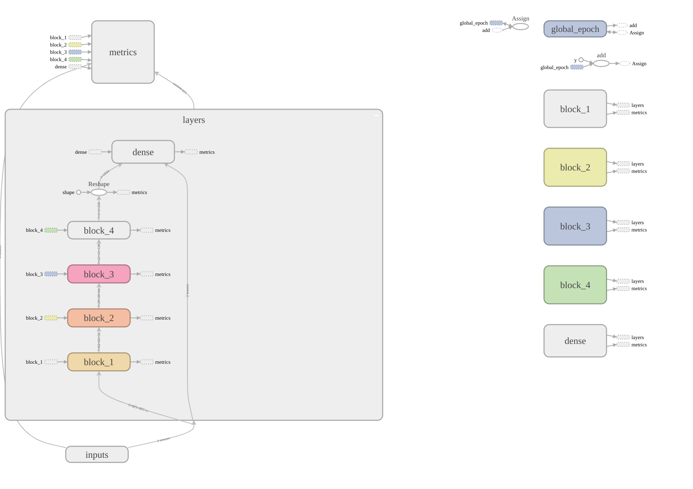

# Roman digits classification

## Introduction

1. [Config](#config)
2. [Data structure](#data-structure)
3. [Data description and cleaning process](#data-description-and-cleaning-process)
4. [Data augmentation and splitting](#data-augmentation-and-splitting)
5. [Model structure](#model-structure)
6. [Instuctions to run the model](#instuctions-to-run-the-model)
   1. [Data preparation](#data-preparation)
   2. [Running model](#running-model)
7. [Authors](#authors)

## Config

**_Config files must be located at `configs` folder._**

Parameters specific for data generation:

- `seed` - seed for random shuffling.
- `image_size` - size of the side for resulting image.
- `number_to_have` - number of images to have in `data_clean/_class_` directory.

Parameters specific for model:

- `exp_name` - defines the model name and paths to write summaries and weights in.
- `learning rate` - learning rate to train model with.
- `use_dropout_block` - if to use dropout between convolutions.
- `use_dropout_dense` - if to use dropout after dense layer.
- `dropout_rate_block` - dropout rate to use between convolutions.
- `dropout_rate_dense` - dropout rate to use after dense layer.
- `write_histograms` - if to write histograms for distribution of activations for each layer.

## Data structure

`data` folder contains original _'dirty'_ data of Roman images, split by classes. The number of images in a single class folder can be any from 0 to Infinity.  
For example, folder `data/1` contains all images marked as class `1`.

`data_clean` folder contains resized, grayscaled and augmented images, split by classes. The number of images in a single class folder must be set in the config file.  
For example, the folder `data_clean/1` contains resized, grayscaled and augmented images, marked as class `1`.

`data_splitted` folder contains data, split into train and test datasets. The number of single class in train dataset must be set in the config file.  
For example, `data_clean/train/1` contains train images, marked as class `1`.

## Data desciption and cleaning process

It was decided to create about 120 images for each class (roman numbers from 1 to 8) and augment that data to get a more versatile dataset so that neural network could be more robust to different variations of data. To achieve a goal of 120 images per class, every team member wrote his variations of roman digits with his/her unique handwriting multiple times.

The process of data cleaning includes resizing images, grayscaling them and saving to folder `data_clean`.

## Data augmentation and splitting

Data augmentation contains applying multiple transformations to data, such as:

- Cropping;
- Padding;
- Blurring;
- Different affine transformations

Data will be generated into the folder `data_clean/_class_` near existing images.

Splitting data contains the process of reading filenames of images and resaving them into folder `data_splitted/(train or test)/_class_`.

## Model structure

We had a task of image classification so that it was decided to use a convolutional network with some tricks and whistles.  
The main graph of the model is shown below.

<details> 
    <summary><b>Graph</b></summary>
        
</details>

Our model consists of 5 blocks, where `block_1` - `block_4` are convolution blocks and `dense` block containing only dense layers. Architectures of each block are separately described below.

### Blocks 1-3

Notice that convolution blocks 1-3 have the same next architecture and channel growth in them is caused by stacking pooling layers:

```
Conv2D -> BatchNormalization -> ReLU -> Dropout (if necessary) ->
-> Conv2D -> BatchNormalization -> ReLU -> concatenated MaxPooling and Average Pooling
```

Convolution kernels have sizes of 3x3 and stride of 1x1.  
Max- and Average-pooling layers have sizes and strides of 2x2 each.

<details> 
    <summary><b>Block structure</b></summary>
        
</details>

### Block 4

In 4th convolution block we do not use stacking of pooling layers, so that number of channels here grows naturally:

```
Conv2D -> BatchNormalization -> ReLU -> Dropout (if necessary) ->
-> Conv2D -> BatchNormalization -> ReLU -> MaxPooling
```

Convolution kernels have sizes of 3x3. The strides of the first one is 1x1 and the second one is 2x2.  
Max-pooling layer has size and stride of 2x2.

<details> 
    <summary><b>Block structure</b></summary>
        
</details>

### Dense block

Dense block consists of 2 hidden dense layers with batch norm and leaky relu between them:

```
Dense -> BatchNormalization -> LeakyReLU -> Dropout (if necessary) ->
-> Dense -> Softmax
```

<details> 
    <summary><b>Block structure</b></summary>
        
</details>

Calculated input and output sizes of each layer are under the spoiler.
<details> 
<summary><b>Input and output sizes:</b></summary>  

- Block 1:
  - Input size: (?, 128, 128, 3)
  - Output size: (?, 62, 62, 32)
- Block 2:
  - Input size: (?, 62, 62, 32)
  - Output size: (?, 29, 29, 64)
- Block 3:
  - Input size: (?, 29, 29, 64)
  - Output size: (?, 12, 12, 128)
- Block 4:
  - Input size: (?, 12, 12, 128)
  - Output size: (?, 4, 4, 256)
- Reshape:
  - Input size: (?, 4, 4, 256)
  - Output size: (?, 1024)
- Dense:
  - Input size: (?, 1024)
  - Output size: (?, 8)

</details>

## Instuctions to run the model

Our project is based on some libraries you might not have. To ensure everything is installed and install missed packages run next commands.

```sh
cd path/to/project/roman_clf
pip install -r requirements.txt
```

### Data preparation

This script will do all the stuff related to data preparation fast and clean. To run it follow instructions below.

```sh
cd path/to/project/roman_clf
python prepare_data.py -c ../configs/roman.json
```

It is easy, isn't it? :)

### Running model

To run the model follow instructions below.

Open and run jupyter notebook [``` roman_clf/src/Best_Model.ipynb```](https://github.com/VVRud/roman_clf/blob/master/src/Best_Model.ipynb)

All necessary libraries will be imported and configs will be set up automatically. All you need to do is just click `run` for all cells.

Model class is formatted into the notebook, as an example, but can be moved to a different file if it would be necessary.

To run the model you will need a lot of computation power. If you don't have it, try using a batch size of 1, it should help.

## Results
After being trained for 1050 epochs, out CNN showed good results: 

`Train loss:` 1.2800413370	

`Train accuracy:` **0.9940649271**


`Test loss:` 1.2813329697

`Test accuracy:` **0.9926757812**

## Authors

- [Vladyslav Rudenko](https://github.com/vvrud)
- [Vladyslav Zalevskyi](https://github.com/vivikar)
- [Pavlo Pyvovar](https://github.com/pavel-pyvovar)
- [Olga Pashneva](https://github.com/datacat01)
